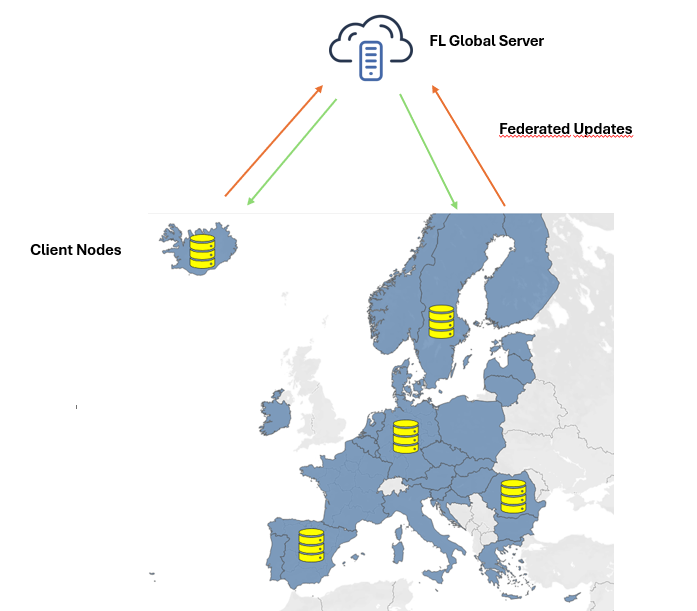

# Master Thesis
Github repository for the master thesis

# Federated Learning for Emergency Management: A Privacy-Preserving City Digital Twin Framework for Pandemic Response

**1st Examiner:** Prof. Dr. Steffan Lessmann

**1st Examiner:** Prof. Dr. Daniel Klapper

An Overview of the FL Framework:

## Table of Contents

- [Summary](#Summary)
- [Repo](#Repo)
- [Results](#Results)

## Summary

The Coronavirus pandemic (COVID-19) has become one of the most devastating health crises in modern times, causing significant loss of life, economic slowdown, and disruptions worldwide. Authorities around the globe have failed to develop data-driven and coordinated policy response measures, further exacerbating the spread of the virus. Several studies in the literature have used Federated Learning (FL) and City Digital Twin (city DT)s to address these challenges. However these mostly focused on different regions within a country and lacked cross-country context which is especially important for a rapidly spreading global pandemic. In this thesis we address this challenge by proposing a privacy-preserving framework for emergency management based on FL and city DT using data from 30 EU/EEA countries. The framework enables multiple countries to collaboratively train a shared epidemic forecasting model without centralizing sensitive health data. Utilizing a Long Short-Term Memory (LSTM)-based time-series model, we conducted a series of simulations to assess the framework’s performance against isolated local model training and a hypothetical centralized model. Moreover we also utilize vaccination and testing data which holds important information regarding pandemic dynamics. Our results suggest that while FL struggles from high data heterogeneity and client drift, the performance improves significantly when the countries are grouped into more homogenous clusters. We also demonstrate the trade-off between model performance and privacy preservation by comparing the performance result of the hypothetical centralized model with that of FL.

## Repo

### Dependencies

Python Version: 3.11.9
pandas version: 2.2.2
numpy version: 1.26.4
keras version: 3.8.0
json version: 2.0.9
flwr (Flower) version: 1.18.0
tensorflow version: 2.18.0
matplotlib version: 3.9.0
keras-tuner version: 1.4.7
scikit-learn (sklearn) version: 1.5.0

### Setup
In order to reproduce the results the preprocessed datasets and jupyter notebooks for the simulations should be downloaded. Then Create an virtual environment and install dependencies. In order to produce the results for different simulations we have made slight changes in the datasets (including/excluding some features and countries). In the repository we have added only the notebook for the Experiment 1 (Scenario 1.5). The code for other experiments are quite similar to this one, only using different datasets for training. In addition we also have included the notebook used for hypothetical training with centralized dataset which should be used with centralized CSV file.

## Results

The figures for the results are presented in [Figures](Figures).                

